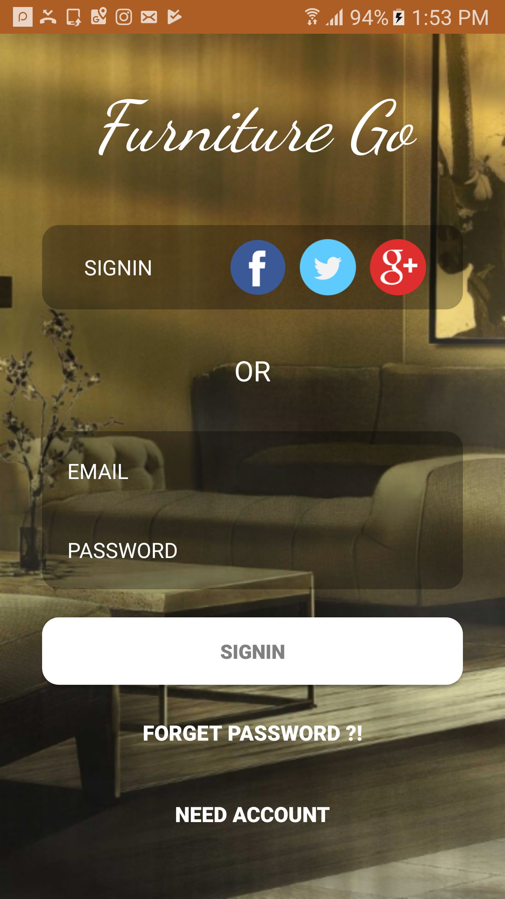
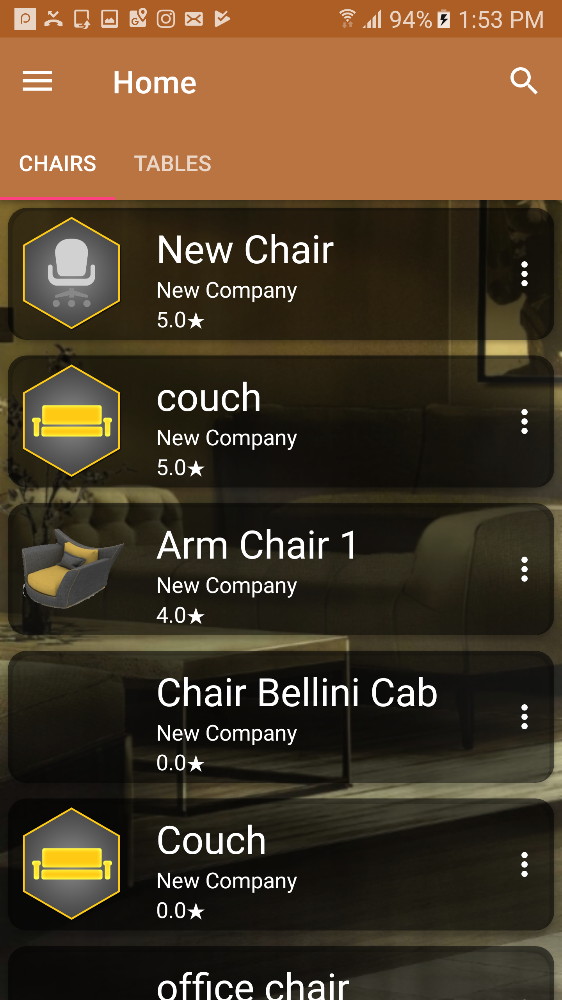
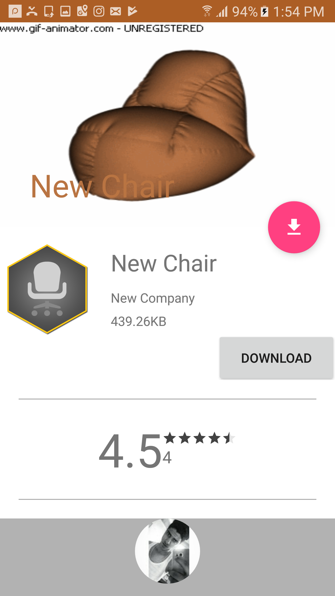
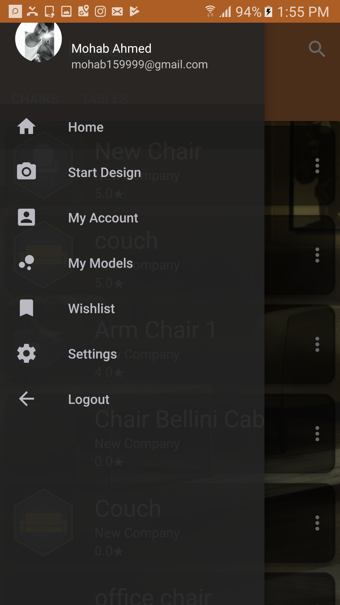
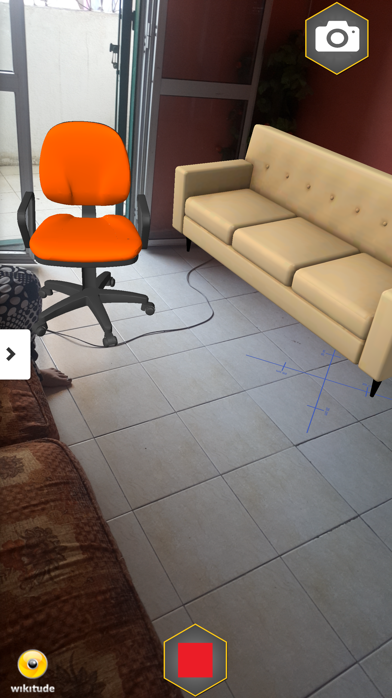

# FurnitureGo
we introduce a new application that used for designing homes furniture, such as changing the places of the furniture and coloring it virtually Based on Augmented Reality without waste of cost and time, these object ll be uploaded by furnitures companies which it helps them to reduce an advertising cost.Augmented Reality AR is a tool that shows a virtual object in a real world. There are many tools for AR, we use Wikitude AR because it supports many platforms. Firebase is a cloud database which Companies can upload their object and it can be downloaded by user

